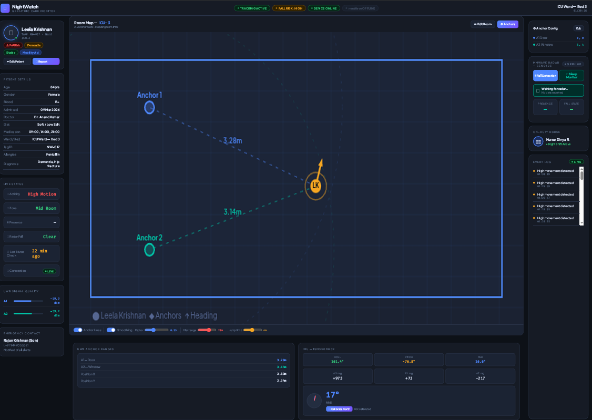
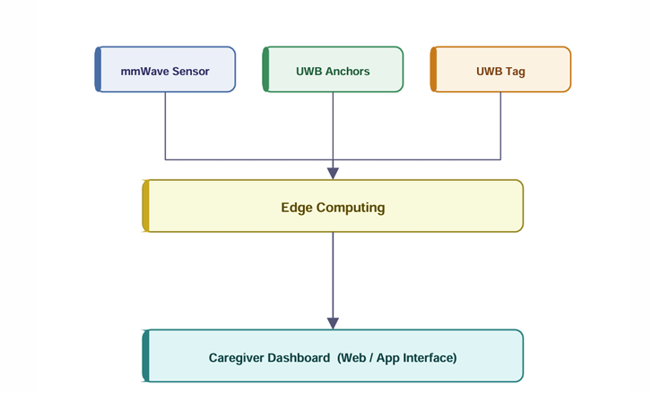
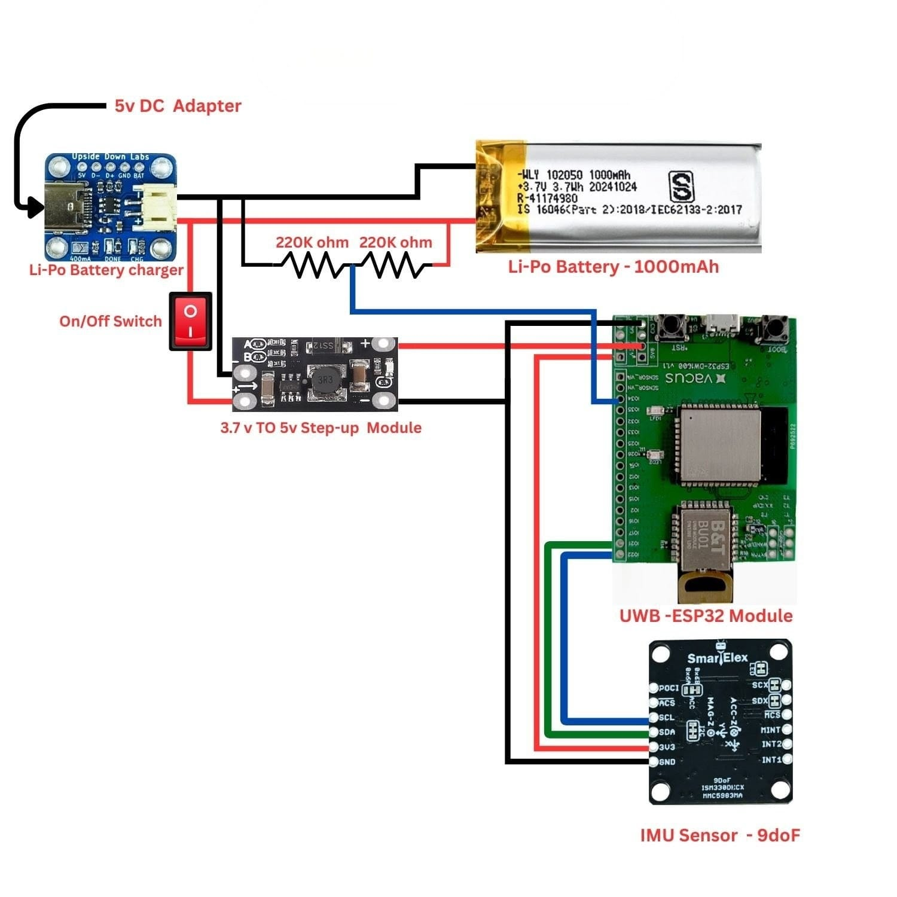
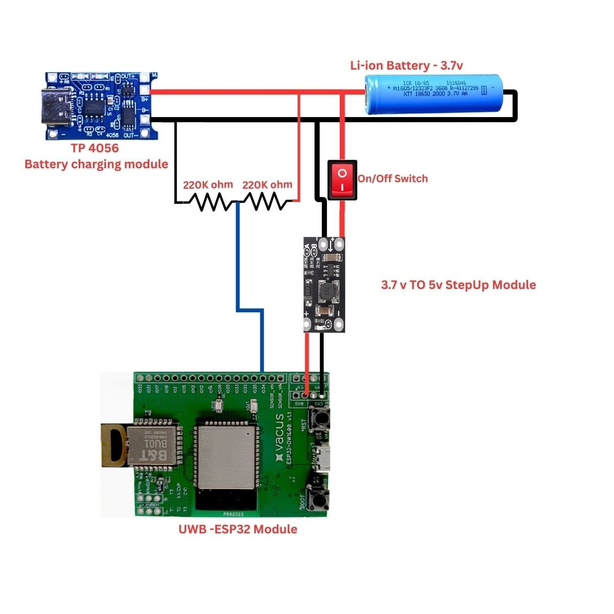
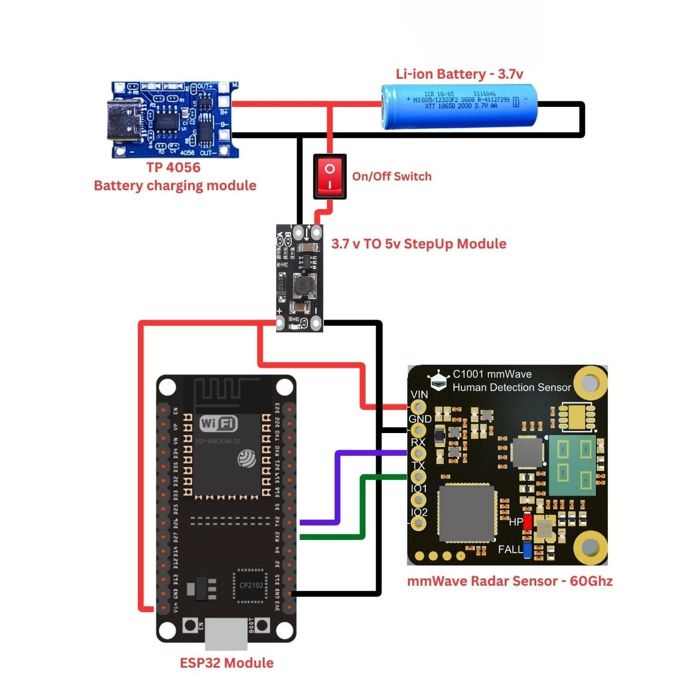
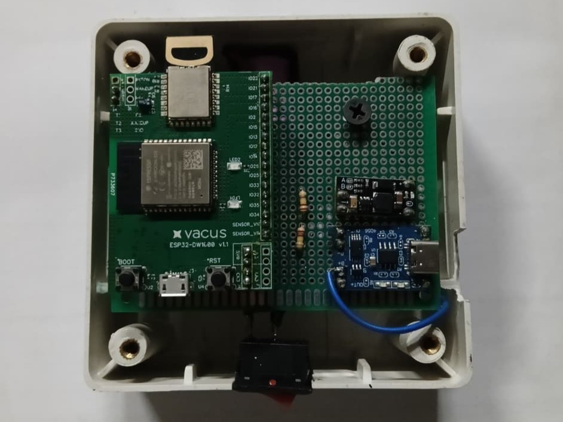
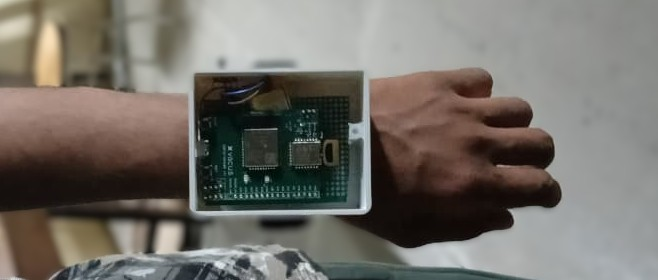
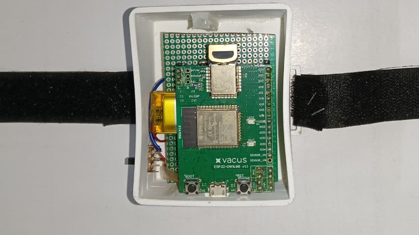
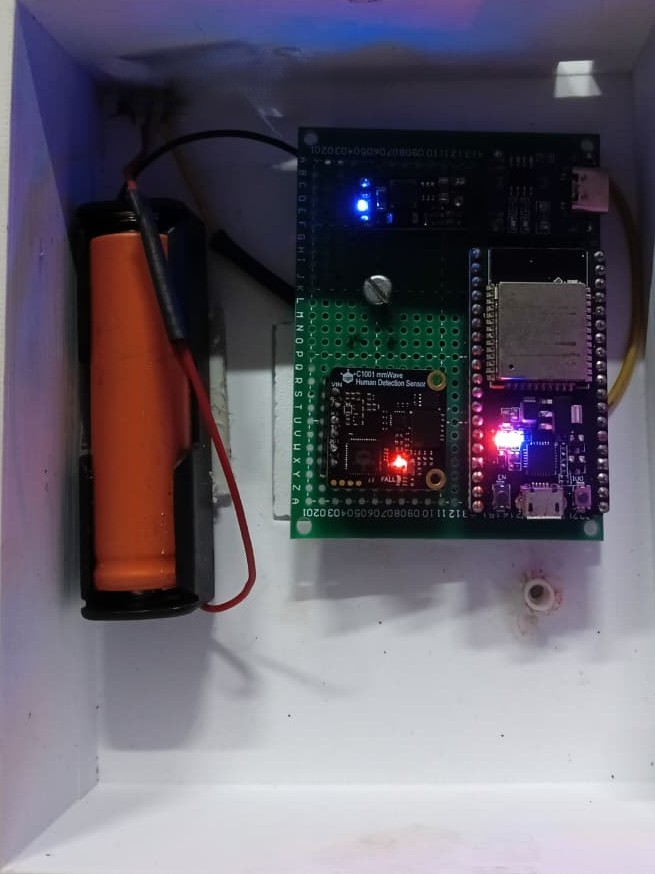

# NightWatch — Privacy-Preserving Elderly Care Monitoring System


## Overview

**NightWatch** is a camera-free, privacy-first elderly care monitoring system that detects **indoor location**, **fall events**, and **sleep vitals** using a multi-sensor fusion approach — all without any camera or microphone.

The system combines **UWB-based indoor localization**, **60 GHz mmWave radar sensing**, and **9-DoF IMU sensor fusion** across a distributed ESP32 network communicating via **ESP-NOW**, with a **Raspberry Pi 4** hub running a real-time **Flask + Socket.IO dashboard**.

> **Why camera-free?**  
> Conventional elderly monitoring systems rely on cameras, raising serious privacy concerns for elderly users in their own homes. NightWatch delivers equivalent safety awareness with zero visual surveillance.

---

## Dashboard



*Real-time caregiver dashboard — shows patient location on room map, UWB anchor ranges, IMU orientation (roll/pitch/yaw), mmWave presence and fall state, and live event log.*

---

## System Architecture



```
┌─────────────────────────────────────────────────────────────┐
│                    SENSING LAYER                            │
│                                                             │
│  ┌──────────────────────┐    ┌────────────────────────────┐ │
│  │  Wearable UWB Tag    │    │   mmWave Radar Node        │ │
│  │  (Vacus ESP32-DW1000)│    │   (ESP32 + DFRobot C1001)  │ │
│  │  + ISM330DHCX IMU    │    │                            │ │
│  │  + MMC5983MA Mag     │    │  Fall detection (MODE_FALL)│ │
│  │                      │    │  Sleep monitoring          │ │
│  │  UWB ranging to      │    │  (MODE_SLEEP)              │ │
│  │  2 fixed anchors     │    │                            │ │
│  └──────────┬───────────┘    └──────────────┬─────────────┘ │
│             │   ESP-NOW                      │ ESP-NOW       │
└─────────────┼────────────────────────────────┼──────────────┘
              │                                │
              ▼                                ▼
┌─────────────────────────────────────────────────────────────┐
│                  RECEIVER ESP32                             │
│         (USB-Serial bridge to Raspberry Pi 4)               │
│   Aggregates UWB + mmWave streams → JSON lines to Pi        │
│   Forwards mode commands (Pi → mmWave) via ESP-NOW          │
└──────────────────────────────┬──────────────────────────────┘
                               │ USB Serial (115200 baud)
                               ▼
┌─────────────────────────────────────────────────────────────┐
│                  RASPBERRY PI 4 HUB                         │
│   Flask + Socket.IO backend  |  NightWatch Web Dashboard    │
│   Serial reader thread       |  WiFi Hotspot (192.168.4.1)  │
│   Mode command API           |  Real-time alerts            │
└─────────────────────────────────────────────────────────────┘
```

---

## Features

| Feature | Implementation |
|---|---|
| Indoor localization | UWB TWR ranging — 2 anchors + 1 wearable tag (Vacus ESP32-DW1000) |
| UWB noise filtering | Median filter (window=5) + exponential smoothing (α=0.25) |
| Fall detection | 3-state machine: IDLE → IMPACT → POSTFALL (impact >3g, tilt >45° within 800ms) |
| Orientation tracking | Tilt-compensated yaw from ISM330DHCX + MMC5983MA |
| Sleep vitals | DFRobot C1001 60 GHz mmWave — respiration rate, heart rate, sleep state |
| Communication | ESP-NOW (no WiFi router required) |
| Dashboard | Flask + Socket.IO real-time web UI on Raspberry Pi 4 |
| Deployment | Pi acts as WiFi hotspot — accessible at `http://192.168.4.1:5000` |
| Privacy | Zero cameras, zero microphones, all processing on-device |

---

## Hardware

### Bill of Materials

| Component | Module | Purpose | Qty |
|---|---|---|---|
| UWB Transceiver | Vacus ESP32-DW1000 | Anchor + Tag nodes | 3 |
| mmWave Radar | DFRobot SEN0623 (C1001) | Fall & sleep detection | 1 |
| IMU + Magnetometer | Smartelex 9DoF (ISM330DHCX + MMC5983MA) | Orientation & tilt | 1 |
| Hub | Raspberry Pi 4 Model B 4GB | Backend + Dashboard | 1 |
| Receiver | Generic ESP32 (WROOM/WROVER) | ESP-NOW ↔ Serial bridge | 1 |
| Power (mmWave) | TP4056 + 18650 Li-ion + 3.7V→5V step-up | mmWave node power | 1 |
| Power (Tag) | Li-Po charger + 1000mAh Li-Po + 3.7V→5V step-up | Wearable tag power | 1 |


---

### Circuit Diagrams

#### Wearable UWB Tag
*Vacus ESP32-DW1000 + Smartelex 9DoF IMU, powered by 1000mAh Li-Po with USB-C charging*



---

#### UWB Anchor Node
*Vacus ESP32-DW1000, powered by 18650 Li-ion with TP4056 charging + 3.7V→5V step-up*



---

#### mmWave Radar Node
*ESP32-WROOM + DFRobot C1001 (60 GHz), UART connection on GPIO16/17, powered by 18650 Li-ion*



---

### Hardware Photos

| UWB Anchor (inside enclosure) | Wearable Tag (wrist-worn) |
|:---:|:---:|
|  |  |

| UWB Tag + IMU (bottom view) | mmWave Radar Node (inside enclosure) |
|:---:|:---:|
|  |  |

---

## Repository Structure

```
nightwatch/
├── firmware/
│   ├── uwb/
│   │   ├── anchor1/anchor1.ino        ← UWB Anchor 1 (Addr: 83:17:...)
│   │   └── anchor2/anchor2.ino        ← UWB Anchor 2 (Addr: 84:17:...)
│   ├── tag/
│   │   └── firmware_tag_espnow.ino    ← Wearable tag: UWB + IMU + ESP-NOW
│   ├── mmwave/
│   │   └── firmware_mmwave_espnow.ino ← mmWave node: DFRobot C1001 + ESP-NOW
│   └── receiver/
│       └── receiver_espnow.ino        ← Receiver: ESP-NOW → Serial bridge
├── dashboard/
│   ├── app.py                         ← Flask + Socket.IO backend
│   ├── requirements.txt               ← Python dependencies
│   └── templates/index.html           ← NightWatch web dashboard (v5)
├── hardware/
│   └── images/                        ← Circuit diagrams and screenshots
├── docs/
│   └── DEPLOY.md                      ← Pi deployment quick reference
├── scripts/
│   └── setup_pi.sh                    ← One-shot Pi setup script
└── README.md
```

---

## Firmware Overview

### UWB Anchors (`firmware/uwb/`)
Two fixed Vacus ESP32-DW1000 anchors placed in the monitoring environment. Each has a unique 8-byte DW1000 address and uses `MODE_LONGDATA_RANGE_LOWPOWER` for reliable ranging.

| | Anchor 1 | Anchor 2 |
|---|---|---|
| Address | `83:17:5B:D5:A9:9A:E2:9C` | `84:17:5B:D5:A9:9A:E2:9D` |
| Antenna delay | 17150 | 17150 |

### UWB Tag + IMU (`firmware/tag/firmware_tag_espnow.ino`)
Wearable node worn by the monitored person. Ranges to both anchors every 100ms, applies spike filtering, reads 9-DoF orientation, and transmits via ESP-NOW.

**Spike filter parameters:**
```cpp
#define BUF_SIZE    5        // median window
#define MAX_RANGE_M 15.0f    // hard ceiling
#define JUMP_THRESH  3.0f    // max single-step jump (m)
```

**JSON transmitted (every 100ms):**
```json
{"src":"UWB","A1":2.341,"A2":4.102,"rssi1":-68.2,"rssi2":-71.0,"roll":3.12,"pitch":-1.45,"yaw":112.3}
```

### mmWave Node (`firmware/mmwave/firmware_mmwave_espnow.ino`)
DFRobot SEN0623 (C1001) radar running two modes switchable at runtime:

| Mode | Data |
|---|---|
| `MODE_FALL` | presence, fall_state (3-state machine: IDLE→IMPACT→POSTFALL) |
| `MODE_SLEEP` | presence, sleep_state, respiration rate, heart rate |

**JSON transmitted (every 50ms):**
```json
{"src":"MMW","mode":"FALL","presence":1,"fall_state":0}
{"src":"MMW","mode":"SLEEP","presence":1,"sleep_state":1,"respiration":18,"heart":72}
```

### Receiver (`firmware/receiver/receiver_espnow.ino`)
Generic ESP32 connected to the Pi via USB. Aggregates ESP-NOW packets from tag and mmWave node, forwards them as JSON lines over serial. Also relays `MODE_FALL`/`MODE_SLEEP` commands from the Pi back to the mmWave ESP32.

> **Setup:** Flash receiver first → open Serial Monitor → copy the printed MAC → paste into `RECEIVER_MAC[]` in both `firmware_tag_espnow.ino` and `firmware_mmwave_espnow.ino`.

---

## Dashboard & Backend

### Flask + Socket.IO (`dashboard/app.py`)

- Serial port auto-detected (`/dev/ttyUSB0`, `ttyUSB1`, `ttyACM0`, `ttyACM1`)
- Gevent-based background thread reads serial, parses JSON, emits to browser via Socket.IO
- `/set_mode?mode=MODE_FALL` or `MODE_SLEEP` — browser triggers radar mode switch
- `/status` — health check endpoint

### Deployment (Raspberry Pi 4)

```bash
# 1. Clone repo onto the Pi
git clone https://github.com/Abhijithuprabhu/NightWatch.git

# 2. Run one-time setup (installs deps, hotspot, systemd service)
cd NightWatch
sudo bash scripts/setup_pi.sh

# 3. Reboot
sudo reboot

# 4. Connect to WiFi: "NightWatch" / "nightwatch123"
# 5. Open browser: http://192.168.4.1:5000
```

See [`docs/DEPLOY.md`](docs/DEPLOY.md) for full deployment reference including service commands, serial port override, and hotspot reconfiguration.

---

## Flashing Order

1. Flash `receiver_espnow.ino` → open Serial Monitor → note printed MAC
2. Paste MAC into `firmware_tag_espnow.ino` and `firmware_mmwave_espnow.ino` as `RECEIVER_MAC[]`
3. Flash `anchor1.ino` and `anchor2.ino`
4. Flash `firmware_tag_espnow.ino` (wearable tag)
5. Flash `firmware_mmwave_espnow.ino` (mmWave node)
6. All nodes must be on the same ESP-NOW WiFi channel (ch 7 — matching Pi hotspot)

---

## Team

| Member | Role |
|---|---|
| **Abhijith U Prabhu** | Project Lead — UWB system, ESP32 firmware, RPi integration, system architecture |
| **Adwait Biju Nair** | Power Systems & mmWave Lead — power management, DFRobot C1001 integration |
| **Sharon Joe Shaji** | Dashboard, Documentation & Version Control |
| **Ann Maria Francis** | Sensor integration support, testing |
| **Pranav V Manoj** | Wearable tag hardware, mechanical design & node enclosures |


---

## Design Philosophy

- **Privacy-first** — no cameras, no microphones; all sensing is RF/inertial
- **Edge processing** — all inference runs on-device; no cloud dependency
- **ESP-NOW mesh** — no WiFi router required in the deployment environment
- **Modular firmware** — each ESP32 node is independently flashable and testable
- **Resilient backend** — serial reconnect loop, gevent async, systemd watchdog

---

## Dependencies

### Arduino Libraries
- `DW1000` — Thotro/arduino-dw1000
- `DFRobot_HumanDetection` — DFRobot SEN0623 library
- `SparkFun ISM330DHCX` — SparkFun 9DoF IMU library
- `SparkFun MMC5983MA` — SparkFun magnetometer library

### Python (Pi)
```
flask>=3.0.0
flask-socketio>=5.3.0
pyserial>=3.5
gevent>=23.0.0
```

---

## License

Developed for academic and research purposes.  
B.Tech Final Year Project — APJ Abdul Kalam Technological University, 2026.  
All rights reserved.
